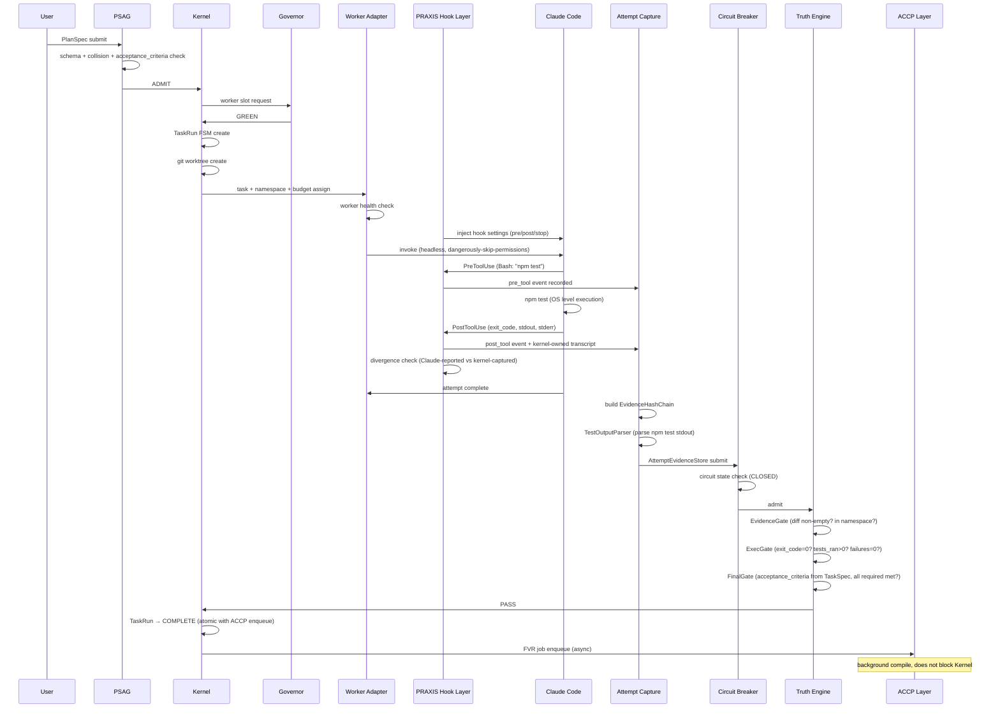
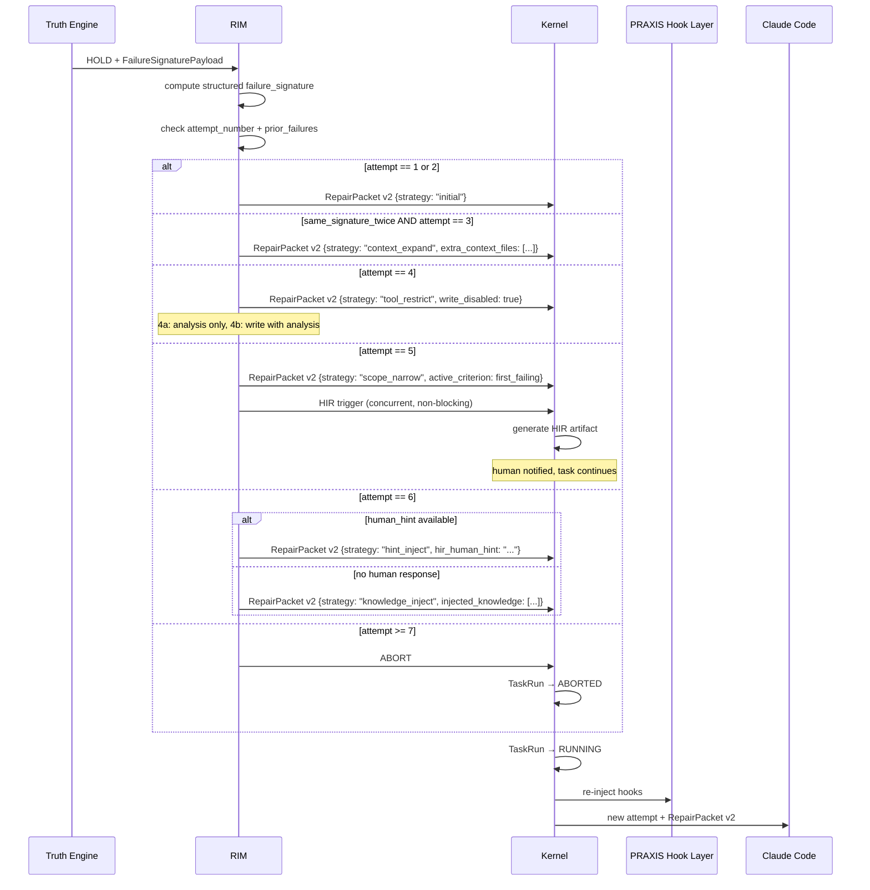
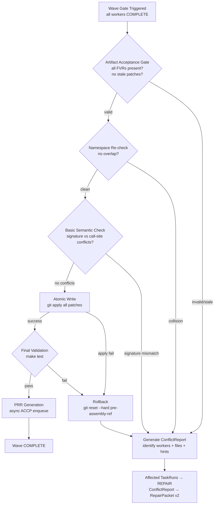
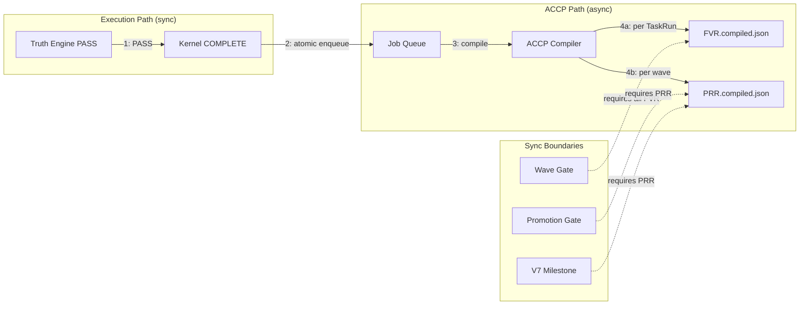
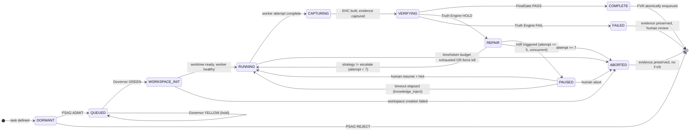

# PRAXIS v2.0

**Parallel Runtime for Autonomous eXecution with Integrated Safety**

> *"Claude says done ≠ done. TruthGate PASS = done."*

PRAXIS is a multi-harness agentic coding execution platform. It orchestrates concurrent AI coding workers on large-scale software projects with **verified, evidence-backed completion** — eliminating false-done hallucinations, namespace corruption, echo-chamber self-verification, and unauditable AI output.

**v2.0 fixes 15 structural problems** identified in the v1.0 design review. See [What Changed in v2.0](#what-changed-in-v20).

---

## Table of Contents

1. [What Changed in v2.0](#what-changed-in-v20)
2. [The Problem](#the-problem)
3. [The Three Laws](#the-three-laws)
4. [Architecture Overview](#architecture-overview)
5. [Components](#components)
   - [0. Day 0 Mandatory Spike](#0-day-0-mandatory-spike)
   - [1. PlanSpec Admission Gate (PSAG)](#1-planspec-admission-gate-psag)
   - [2. Auto Executor Kernel](#2-auto-executor-kernel)
   - [3. PRAXIS Hook Layer ★ NEW](#3-praxis-hook-layer--new)
   - [4. Worker Adapter Layer](#4-worker-adapter-layer)
   - [5. Attempt Capture + Evidence Hash Chain](#5-attempt-capture--evidence-hash-chain)
   - [6. Circuit Breaker](#6-circuit-breaker)
   - [7. Truth Engine](#7-truth-engine)
   - [8. Repair Intelligence Module (RIM)](#8-repair-intelligence-module-rim)
   - [9. Adaptive Concurrency Governor](#9-adaptive-concurrency-governor)
   - [10. Deterministic Assembler](#10-deterministic-assembler)
   - [11. ACCP Artifact Layer](#11-accp-artifact-layer)
6. [Namespace Partition Rules](#namespace-partition-rules)
7. [Data Flows](#data-flows)
8. [TaskRun Finite State Machine](#taskrun-finite-state-machine)
9. [Truth Engine Deep Dive](#truth-engine-deep-dive)
10. [RIM Deep Dive](#rim-deep-dive)
11. [Phase Transition Criteria](#phase-transition-criteria)
12. [CLI Observability](#cli-observability)
13. [Implementation Roadmap](#implementation-roadmap)
14. [Explicitly NOT In Scope](#explicitly-not-in-scope)
15. [Design Decisions (ADRs)](#design-decisions-adrs)
16. [Scoring](#scoring)

---

## What Changed in v2.0

| # | Problem (v1.0) | Fix (v2.0) | Section |
|---|---------------|-----------|---------|
| 1 | EHC break: no distinction between bug and tampering | `EHCBreakClassifier` — 3-tier evidence classification | [§5](#5-attempt-capture--evidence-hash-chain) |
| 2 | "clean operation" undefined | Precise 5-metric definition | [§Phase Transition](#phase-transition-criteria) |
| 3 | ExecGate transcript worker-reported (self-reported) | **PRAXIS Hook Layer** — kernel-owned command interception | [§3](#3-praxis-hook-layer--new) |
| 4 | ExecGate only checks exit code | `TestOutputParser` — test runner stdout parse | [§7](#7-truth-engine) |
| 5 | FinalGate checklist can be agent-generated (echo chamber) | `acceptance_criteria` required in TaskSpec and human-authored | [§7](#7-truth-engine) |
| 6 | Integration test substitute — pass/fail ambiguity | Min assertion count + zero-test-ran guard | [§7](#7-truth-engine) |
| 7 | RIM failure signature coarse (string hash) | Structured `FailureSignaturePayload` with `failed_criteria_ids` | [§8](#8-repair-intelligence-module-rim) |
| 8 | RIM strategy rotation shallow ("different wording") | 6 concrete strategies (tool_restrict, context_expand, scope_narrow, knowledge_inject, hint_inject, escalate) | [§8](#8-repair-intelligence-module-rim) |
| 9 | Claude Code adapter — headless API unknown | Day 0 Mandatory Spike (go/no-go gate) | [§0](#0-day-0-mandatory-spike) |
| 10 | Assembler semantic conflict deferred to Phase 3 | Basic signature/call-site check moved into Phase 1 | [§10](#10-deterministic-assembler) |
| 11 | Shared package namespace unresolved | `PredictedInterface` + exclusive namespace lock | [§Namespace](#namespace-partition-rules) |
| 12 | No recovery after Assembler rollback | `ConflictReport` → injected into RepairPacket v2 | [§10](#10-deterministic-assembler) |
| 13 | Phase 0 scope too aggressive (5 components in 7 days) | Phase 0 split into 0.1 / 0.2 / 0.3 | [§Roadmap](#implementation-roadmap) |
| 14 | Phase transition criteria undefined | Numeric threshold table for every tier | [§Phase Transition](#phase-transition-criteria) |
| 15 | Observability = "JSON + grep" insufficient in production | `praxis` CLI (status, runs, run, wave, logs) in Phase 2 | [§CLI](#cli-observability) |

---

## The Problem

AI coding agents are powerful individually, but unreliable as systems.

| Problem | Symptom | Root Cause |
|---------|---------|--------------|
| **False Done** | Claude says "done", but the diff is empty | No external verification authority |
| **Echo Chamber** | Checklist generated by the agent and verified by the agent | Acceptance criteria source is not audited |
| **Self-Reported Transcript** | Test transcript comes from what Claude claims | No kernel-owned command capture |
| **Sequential Bottleneck** | 30 workspaces run sequentially | No safe parallelism primitive |
| **Repo Corruption** | Multiple workers corrupt shared files | No assembly governance |
| **Repair Loop Stupidity** | Same error → same prompt → same error | No repair memory or strategy diversity |
| **Shared Package Deadlock** | Two workers need the same shared package | Missing namespace partition strategy |

PRAXIS solves these seven problems.

---

## The Three Laws

These rules cannot be violated. No exceptions. Ever.

```
LAW 1  —  COMPLETION AUTHORITY
         Claude says done ≠ done.
         Truth Engine FinalGate PASS = done.
         Nothing else counts. No exceptions.

LAW 2  —  WRITE AUTHORITY
         No worker writes to a shared integration file.
         The Deterministic Assembler is the only shared writer.
         Always. No exceptions. Ever.

LAW 3  —  VERIFICATION AUTHORITY
         FinalGate acceptance criteria comes from the human-authored TaskSpec.
         An agent cannot define its own completion criteria.
         An agent cannot verify criteria it generated itself.
```

---

## Architecture Overview

```
╔══════════════════════════════════════════════════════════════════════════════╗
║                           USER / PLAN / GOAL                                ║
╚═══════════════════════════════════╦════════════════════════════════════════╝
                                    ║
                                    ▼
╔══════════════════════════════════════════════════════════════════════════════╗
║           [1]  PLANSPEC ADMISSION GATE  (PSAG)                              ║
║                                                                              ║
║   schema · namespace collision · budget feasibility · dependency cycles      ║
║   quality score ≥ 7.0 · acceptance_criteria present + human-authored        ║
║                                                                              ║
║   ADMIT  /  WARN (flagged admit)  /  REJECT                                 ║
╚═══════════════════════════════════╦════════════════════════════════════════╝
                                    ║ ADMIT
                                    ▼
╔══════════════════════════════════════════════════════════════════════════════╗
║           [2]  AUTO EXECUTOR KERNEL                                          ║
║                                                                              ║
║   FSM · Plan Queue · Workspace Manager · Resource Governor                  ║
║   Retry Policy Engine · Force Kill/Delete · Worker Health Registry          ║
╚═══════════════════════════════════╦════════════════════════════════════════╝
                                    ║
          ╔═════════════════════════╬═════════════════════════╗
          ║                         ║                         ║
          ▼                         ▼                         ▼
    [ Worker A ]             [ Worker B ]             [ Worker C ]
    namespace_a              namespace_b              namespace_c
    (exclusive)              (exclusive)              (exclusive)
          ║                         ║                         ║
          ╚═════════════════════════╬═════════════════════════╝
                                    ║
                                    ▼
╔══════════════════════════════════════════════════════════════════════════════╗
║           [4]  WORKER ADAPTER LAYER                                          ║
║                                                                              ║
║   Primary: Claude Code CLI/SDK · Future: OpenCode, local models             ║
║   Health check before admission · Output → AttemptManifest v1.0            ║
╚═══════════════════════════════════╦════════════════════════════════════════╝
                                    ║ tool_use events (JSON stream)
                                    ▼
╔══════════════════════════════════════════════════════════════════════════════╗
║           [3]  PRAXIS HOOK LAYER  ★ NEW                                     ║
║                                                                              ║
║   Intercepts ALL Claude Code tool events via hook system                    ║
║   BEFORE they are processed by Claude Code itself.                          ║
║                                                                              ║
║   pre-tool:  record command + arguments + timestamp                         ║
║   post-tool: record result + exit_code + stdout + stderr                    ║
║   stop:      record session end + final state                               ║
║                                                                              ║
║   Divergence check: kernel-captured result ≠ Claude-reported result         ║
║   → flag inconsistency → EHC integrity event                                ║
║                                                                              ║
║   Output: KernelOwnedTranscript (immutable, kernel-authored)                ║
╚═══════════════════════════════════╦════════════════════════════════════════╝
                                    ║
                                    ▼
╔══════════════════════════════════════════════════════════════════════════════╗
║           [5]  ATTEMPT CAPTURE + EVIDENCE HASH CHAIN                         ║
║                                                                              ║
║   Captures: stdout/stderr · KernelOwnedTranscript · exit codes ·            ║
║             changed files · git diff · timestamps · workspace snapshot      ║
║                                                                              ║
║   EHC: sha256(content + timestamp_ns + worker_id) → chained                 ║
║                                                                              ║
║   EHCBreakClassifier:                                                        ║
║     NOISE     → isolated break, auto-recoverable                            ║
║     SUSPECTED → pattern break, log + alert, continue                        ║
║     CONFIRMED → multi-signal break, Circuit Breaker OPEN                   ║
╚═══════════════════════════════════╦════════════════════════════════════════╝
                                    ║
                                    ▼
╔══════════════════════════════════════════════════════════════════════════════╗
║           [6]  CIRCUIT BREAKER                                               ║
║                                                                              ║
║   CLOSED → OPEN → HALF-OPEN → CLOSED                                        ║
║                                                                              ║
║   Triggers OPEN:  failure_rate > 30% / 10min                                ║
║                   governor_RED > 15min continuous                            ║
║                   EHC break classified as CONFIRMED                         ║
╚═══════════════════════════════════╦════════════════════════════════════════╝
                                    ║
                                    ▼
╔══════════════════════════════════════════════════════════════════════════════╗
║           [7]  TRUTH ENGINE                                                  ║
║                                                                              ║
║   ┌──────────────────┐  ┌──────────────────┐  ┌──────────────────────────┐  ║
║   │  EvidenceGate    │→ │  ExecGate        │→ │  FinalGate               │  ║
║   │                  │  │                  │  │                          │  ║
║   │ diff non-empty?  │  │ KernelOwned-     │  │ acceptance_criteria       │  ║
║   │ changes within   │  │ Transcript:      │  │ from TaskSpec ONLY.       │  ║
║   │ namespace?       │  │ exit_code = 0?   │  │ (human-authored, PSAG    │  ║
║   │                  │  │ TestOutput-      │  │  validated)              │  ║
║   │                  │  │ Parser: N tests  │  │                          │  ║
║   │                  │  │ ran, 0 failures, │  │                          │  ║
║   │                  │  │ M assertions?    │  │                          │  ║
║   └──────────────────┘  └──────────────────┘  └──────────────────────────┘  ║
║                                                                              ║
║   [WiringGate: POST-MVP placeholder, disabled]                              ║
║   Output: PASS / HOLD / FAIL                                                 ║
╚═══╦════════════════════════╦═══════════════════╦══════════════════════════╝
    ║ PASS                   ║ HOLD              ║ FAIL
    ▼                        ▼                   ▼
    │             ╔══════════════════════╗    HIR / ABORT
    │             ║  [8]  RIM            ║
    │             ║                      ║
    │             ║  structured failure  ║
    │             ║  signature           ║
    │             ║  6 real strategies   ║
    │             ║  HIR @ attempt 5     ║
    │             ║  ABORT @ attempt 7   ║
    │             ╚══════════╦═══════════╝
    │                        ║ RepairPacket v2
    │                        ▼
    │             Claude Code Repair Attempt
    │             (→ RUNNING state)
    ▼
╔══════════════════════════════════════════════════════════════════════════════╗
║           [9]  ADAPTIVE CONCURRENCY GOVERNOR                                 ║
║                                                                              ║
║   stable_3 → stable_6 → stable_8 → stable_12 → stable_16 → REVIEW          ║
║   (each tier: 48h consecutive clean operation, defined metrics)             ║
╚═══════════════════════════════════╦════════════════════════════════════════╝
                                    ║ (wave / plan completion only)
                                    ▼
╔══════════════════════════════════════════════════════════════════════════════╗
║           [10] DETERMINISTIC ASSEMBLER                                       ║
║                                                                              ║
║   Pre-flight: namespace re-check + basic semantic check (Phase 1+)          ║
║   Write: atomic (all-or-nothing)                                            ║
║   Failure: rollback + ConflictReport → RepairPacket v2                     ║
╚═══════════════════════════════════╦════════════════════════════════════════╝
                                    ║
                                    ▼
╔══════════════════════════════════════════════════════════════════════════════╗
║           [11] ACCP ARTIFACT LAYER  ⟵ ALWAYS ASYNC                          ║
║                                                                              ║
║   NEVER on execution critical path.                                          ║
║   MVP: FVR (per TaskRun) + PRR (per wave). 2 report types only.             ║
╚══════════════════════════════════════════════════════════════════════════════╝
```

---

## Components

### [0] Day 0 Mandatory Spike

**This is not a component; it is a prerequisite for the entire plan.**

PRAXIS's primary worker is the Claude Code CLI/SDK. Before Phase 0 begins, the project must know whether Claude Code can run in headless/autonomous mode, whether its hook system is reliable, and whether rate limits can support the Phase 1 concurrency target.

**Spike objectives (1 day, go/no-go gate):**

| Objective | Expected Result | Fallback |
|-------|---------------|---------|
| Does `claude --dangerously-skip-permissions` run headlessly? | Yes, it can execute tool calls without human approval | Claude Messages API + custom tool definitions |
| Does the hook system (pre-tool, post-tool) capture all tool calls? | Every Bash/Edit/Write tool event reaches the hook | Shell wrapper (LD_PRELOAD or PTY) |
| Does the hook run pre-tool, post-tool, or both? | Both — timing is critical | Start with post-tool only; defer pre-tool to Phase 1 |
| Is there a kernel-captured stdout ≠ Claude-reported summary case? | Yes: "3 tests passed", but stdout contains "2 failures" | EHC divergence flag activates |
| At what point does N concurrent Claude Code sessions hit the rate limit? | Example: 6 concurrent sessions → rate limit at minute 4 | Set the Governor YELLOW trigger threshold based on the rate limit |

**Spike output:**

```yaml
spike_report:
  date: "..."
  claude_code_version: "..."
  headless_mode_verified: true/false
  hook_system_reliable: true/false
  hook_captures_all_tools: true/false
  pre_hook_available: true/false
  divergence_case_found: true/false
  rate_limit_at_n_workers: N
  decision: "GO" / "NO-GO: use Messages API fallback"
```

**In the NO-GO case:** Phase 0 starts with the Messages API fallback architecture. This fallback is defined in ADR-005 at the end of this README.

---

### [1] PlanSpec Admission Gate (PSAG)

**Position:** Before the Execution Kernel starts any work.

v2.0 changes:
- `acceptance_criteria` is required: REJECT if missing
- `criteria_source` check: REJECT if `'generated'` (agent-authored checklists are not accepted)

**Checks:**

| Check | Description | Failure State |
|-------|----------|-------------|
| Schema Validation | PlanSpec is valid JSON/YAML | REJECT |
| Namespace Collision | Do two workers share the same file? | REJECT |
| Shared Package Audit | Are shared packages marked as exclusive-owner or assembler-synthesized? | REJECT |
| Budget Feasibility | task_count × avg_cost ≤ total_budget | WARN or REJECT |
| Dependency Cycles | Are there cyclic task dependencies? | REJECT |
| **acceptance_criteria Present** | Does every task have a populated `acceptance_criteria` field? | **REJECT** |
| **criteria_source Verified** | Is `criteria_source == 'human'`? | **REJECT** if 'generated' |
| Quality Score | Weighted score of all checks is ≥ 7.0/10 | REJECT |

**Required TaskSpec fields (v2.0):**

```typescript
interface TaskSpec {
  task_id: string;
  wave: number;
  namespace: string[];            // exclusive file paths this worker owns
  task_type: 'code' | 'docs' | 'test' | 'shared_package';
  description: string;
  
  // v2.0: REQUIRED. PSAG rejects if missing or criteria_source !== 'human'
  acceptance_criteria: AcceptanceCriterion[];
  criteria_source: 'human';       // literal type — 'generated' is rejected
  
  budget: TaskBudget;
  dependencies: string[];         // task_ids that must COMPLETE before this starts
  
  // For tasks that need shared packages
  predicted_interfaces?: PredictedInterface[];  // see Namespace section
}

interface AcceptanceCriterion {
  id: string;                     // unique, stable identifier (e.g. "AC-001")
  description: string;            // what must be true
  verification_type: 'file_exists' | 'test_passes' | 'command_output' | 'diff_contains' | 'no_diff_contains';
  verification_detail: string;    // concrete check (file path, test name, regex)
  required: boolean;              // false = nice-to-have, logged but not blocking
}
```

---

### [2] Auto Executor Kernel

**Owns:** The task lifecycle from admission to completion. Nothing else does this.

**Sub-systems (unchanged from v1.0):**

| Sub-system | Responsibility |
|-----------|------------|
| Plan Queue / Scheduler | Task ordering, wave sequencing, priority |
| Workspace / Worktree Manager | Isolated git worktree for each worker |
| Resource Governor | Token budget + time budget per TaskRun |
| Retry Policy Engine | Max attempts, backoff, budget tracking |
| Force Kill / Delete | OS-level worker termination + workspace cleanup |
| Worker Health Registry | Per-worker health, exclusion, auto-recovery |

**Why Resource Governor (token budget) is separate:**

```
Concurrency Governor question:  "how many workers can run at the same time?"
Resource Governor question:     "how expensive is each worker?"

These are orthogonal questions. A single expensive worker can exhaust the budget even when there is no concurrency problem.
```

---

### [3] PRAXIS Hook Layer ★ NEW

**This component is the foundation of ExecGate reliability.**

**Problem (v1.0):** Who produces the command transcript? If the worker (Claude) self-reports the results of its own commands, ExecGate cannot catch the worker's lie.

```
Claude: "I ran npm test, exit 0, all passed."
Reality: 3 tests failed, 2 skipped — Claude only looked at the exit code and summarized it.
v1.0 ExecGate: Cannot catch this falsehood.
v2.0 PRAXIS Hook Layer: Reports both pre-tool and post-tool events to the kernel.
```

**Operating principle:**

PRAXIS uses Claude Code's hook system to intercept every tool event. Hooks are defined in `~/.claude/settings.json` and are invoked by Claude Code during tool execution.

```json
// ~/.claude/settings.json (injected by PRAXIS)
{
  "hooks": {
    "PreToolUse": [{
      "matcher": "*",
      "hooks": [{
        "type": "command",
        "command": "praxis-hook pre-tool --attempt-id $PRAXIS_ATTEMPT_ID"
      }]
    }],
    "PostToolUse": [{
      "matcher": "*",
      "hooks": [{
        "type": "command",
        "command": "praxis-hook post-tool --attempt-id $PRAXIS_ATTEMPT_ID"
      }]
    }],
    "Stop": [{
      "hooks": [{
        "type": "command",
        "command": "praxis-hook stop --attempt-id $PRAXIS_ATTEMPT_ID"
      }]
    }]
  }
}
```

**Hook event flow:**

```
Claude Code: "I am going to run the Bash tool: npm test"
      │
      ▼
PreToolUse hook fires
      │
      ▼ PRAXIS Hook Layer records:
      {
        event: "pre_tool",
        tool_name: "Bash",
        input: { command: "npm test" },
        timestamp_ns: ...,
        attempt_id: "ATT-001"
      }
      │
      ▼
Claude Code: actually runs npm test (OS level)
      │
      ▼
PostToolUse hook fires
      │
      ▼ PRAXIS Hook Layer records:
      {
        event: "post_tool",
        tool_name: "Bash",
        input: { command: "npm test" },
        output: { stdout: "...(full raw output)...", exit_code: 1 },
        timestamp_ns: ...,
        attempt_id: "ATT-001"
      }
      │
      ▼
Claude Code returns to its internal state
(What Claude sees = Claude Code's output parsing)
(What PRAXIS sees = raw hook capture = KernelOwnedTranscript)
```

**Divergence detection:**

If there is a mismatch between Claude Code's tool result and the hook-captured raw output:

```typescript
function checkDivergence(
  hookCaptured: RawToolOutput,
  claudeReported: ToolResult
): DivergenceEvent | null {
  // exit code divergence
  if (hookCaptured.exit_code !== claudeReported.exit_code) {
    return { type: 'exit_code_mismatch', severity: 'HIGH' };
  }
  // test result divergence (handled below by TestOutputParser)
  if (parseTestResults(hookCaptured.stdout).failures > 0 &&
      claudeReported.summary.includes('all passed')) {
    return { type: 'test_result_mismatch', severity: 'CRITICAL' };
  }
  return null;
}
```

The divergence event is recorded in EHC as `SUSPECTED` or `CONFIRMED`.

**Spike requirement:** The Day 0 Spike must verify that the hook system captures every tool (Bash, Edit, Write, Read) and that its timing (pre/post) is correct. If the hook system is not reliable, PRAXIS falls back to the PTY wrapper (ADR-005).

---

### [4] Worker Adapter Layer

**Purpose:** Normalize every coding worker's output into a single `AttemptManifest` format.

**Primary worker: Claude Code Official CLI / SDK**

Future workers via adapters:
- OpenCode
- Aider
- Local Qwen / DeepSeek (inference server)

**Key contract:** The Truth Engine does not know which worker ran. It only evaluates `AttemptEvidenceStore` records.

**Worker health rules:**

```yaml
exclude_if:
  consecutive_failures: >= 3

flag_degraded_if:
  pass_rate_last_20: < 20%
  avg_latency: "> 3x baseline"

auto_recover:
  condition: "health check attempt PASS"
  action: "re-admit to pool"
```

---

### [5] Attempt Capture + Evidence Hash Chain

**Purpose:** Build the ground truth evaluated by the Truth Engine.

**Capture sources (v2.0):**

| Source | v1.0 | v2.0 |
|--------|------|------|
| stdout/stderr | ✓ | ✓ |
| Command transcript | worker-reported | **kernel-owned** (Hook Layer) |
| Exit codes | ✓ | ✓ |
| Changed files | ✓ | ✓ |
| Git diff | ✓ | ✓ |
| Timestamps | ✓ | ✓ |
| **Divergence events** | ✗ | ✓ (Hook vs Claude mismatch) |
| **Test parsed results** | ✗ | ✓ (TestOutputParser) |

**Evidence Hash Chain (EHC):**

```typescript
interface EvidenceRecord {
  id: string;
  attempt_id: string;
  worker_id: string;
  timestamp_ns: bigint;
  source: 'kernel_hook' | 'git' | 'filesystem' | 'divergence_detector';
  kind: 'pre_tool' | 'post_tool' | 'diff' | 'file_change' | 'divergence';
  content: string;
  content_hash: string;   // sha256(content + timestamp_ns + worker_id + source)
  chain_hash: string;     // sha256(prev_chain_hash + content_hash)
}
```

**EHCBreakClassifier (v2.0 — not present in v1.0):**

v1.0 problem: when the hash chain broke, the system could not distinguish a bug from real tampering, so every break opened the Circuit Breaker. This caused false-positive openings.

```
NOISE     (Tier 1) — isolated single break
  Condition: a single record hash mismatch, with previous and next records consistent
  Likely cause: race condition, clock skew, transient write error
  Action: log + alert, auto-re-hash (idempotent re-capture), continue
  Circuit Breaker: unchanged (stays CLOSED)

SUSPECTED (Tier 2) — pattern break
  Condition: N+1 consecutive breaks from the same worker OR
             exit_code mismatch at the same time as the break OR
             divergence event at the same time as the break
  Likely cause: hook system error, worker process crash, or tampering
  Action: log + alert + flag TaskRun, freeze evidence (no new records),
          human notification (non-blocking)
  Circuit Breaker: unchanged (stays CLOSED)

CONFIRMED (Tier 3) — multi-signal break
  Condition: SUSPECTED + (second independent integrity signal) OR
             simultaneous breaks from different workers OR
             pre-tool/post-tool timestamp inconsistency (future event)
  Likely cause: real tampering or systemic hook failure
  Action: Circuit Breaker OPEN, all in-flight TaskRuns PAUSED,
          full evidence audit required, human must reset
  Circuit Breaker: OPEN
```

---

### [6] Circuit Breaker

**Purpose:** Prevent cascade failure spirals.

```
CLOSED ──────────────────── Normal. All attempts enter the Truth Engine.
   │
   │ [trigger]
   ▼
OPEN ────────────────────── Halt. No new admissions.
   │                        In-flight attempts finish their current attempt.
   │                        Human notified.
   │
   │ [cooldown elapsed OR human reset]
   ▼
HALF-OPEN ──────────────── 1 test attempt. PASS → CLOSED. FAIL → OPEN.
```

**Triggers:**

```yaml
open_triggers:
  failure_rate:
    threshold: "> 30%"
    window: "10 minute sliding window"

  governor_red:
    duration: "> 15 minutes continuous"

  ehc_break:
    classification: "CONFIRMED"    # only CONFIRMED; NOISE and SUSPECTED do not open it
```

**In OPEN state:** Zero new admissions. Human receives:
- Current failure rate snapshot
- Top failing gates (sorted by frequency)
- Governor state
- EHC break classification (if applicable)
- Last 10 failed verdicts with evidence summaries

---

### [7] Truth Engine

**Purpose:** Tek completion otoritesi. Truth Engine FinalGate PASS = done.

The Truth Engine evaluates `AttemptEvidenceStore` records. It does not know which worker ran. It does not trust self-reports. It evaluates only ground truth.

#### EvidenceGate

```
Q: Real file changes occurred within declared namespace?

Input: git diff, changed_files list, namespace declaration

PASS:
  · git diff non-empty
  · changed_files list matches actual diff  
  · at least 1 file modified within declared namespace

HOLD:
  · diff is empty (most common false-done signal)
  · no files changed

FAIL:
  · changes detected OUTSIDE declared namespace (namespace violation)
  · changed_files list inconsistent with git diff (self-report mismatch)
```

#### ExecGate (v2.0 — TestOutputParser eklendi)

```
Q: Did commands run with valid exit codes AND did tests actually pass?

Input: KernelOwnedTranscript (from Hook Layer, NOT from worker)

PASS:
  · KernelOwnedTranscript exists (not empty, not worker-reported)
  · at least 1 command ran
  · final exit_code = 0
  · IF test runner detected: TestOutputParser confirms
      - tests_ran > 0 (not empty suite)
      - test_failures = 0
      - assertions > minimum threshold (configurable, default: 1)

HOLD:
  · transcript empty or missing
  · exit_code ≠ 0
  · test runner detected but tests_ran = 0 (empty suite — import error, skip-all)
  · test runner detected but test_failures > 0

FAIL:
  · forbidden command attempted (from Kernel-defined blocklist)
  · KernelOwnedTranscript indicates divergence with Claude-reported result
```

**TestOutputParser** — supported test runners:

```typescript
interface TestOutputParser {
  // Detects and parses common test runner outputs
  supportedRunners: ['jest', 'vitest', 'mocha', 'pytest', 'go test', 'cargo test', 'rspec'];
  
  parse(stdout: string): TestRunResult | null;  // null if no test runner detected
}

interface TestRunResult {
  runner: string;
  tests_ran: number;
  test_failures: number;
  test_skipped: number;
  assertions: number | null;       // not all runners report assertions
  suite_empty: boolean;            // true if 0 tests ran
  parse_confidence: 'high' | 'medium' | 'low';
}
```

If the test runner is not recognized: ExecGate checks only the exit code and logs the TestOutputParser result as WARN (it does not force HOLD). New runners start with parse_confidence = 'low'.

#### FinalGate (v2.0 — acceptance_criteria source fix)

**The v1.0 Echo Chamber Problem:**

```
WRONG (v1.0):
  Agent reads the task description
  Agent generates the completion checklist      ← source: agent
  Agent fills out the completion checklist       ← verifier: same agent
  FinalGate: "checklist filled, PASS"       ← agent verified itself

CORRECT (v2.0):
  Human writes acceptance_criteria into TaskSpec ← source: human
  PSAG verifies criteria_source == 'human'       ← admission control
  FinalGate reads only from TaskSpec             ← no agent intervention
  Agent can never write its own criteria         ← LAW 3
```

```
Q: Are all required acceptance criteria satisfied?

Input: TaskSpec.acceptance_criteria (human-authored, PSAG-validated)
       AttemptEvidenceStore (git diff, command transcript, workspace)

For each criterion (verification_type):

  'file_exists':
    → check workspace filesystem + git diff
    → HOLD if required file not found

  'test_passes':
    → check KernelOwnedTranscript for test runner output
    → TestOutputParser: specific test name passed?
    → HOLD if test not found or failed

  'command_output':
    → check KernelOwnedTranscript for command + expected output pattern
    → HOLD if command not run or output pattern not matched

  'diff_contains':
    → check git diff for expected code pattern (regex)
    → HOLD if pattern not in diff

  'no_diff_contains':
    → check git diff for ABSENCE of pattern (debug code, secrets)
    → FAIL if forbidden pattern found

Required criteria: all must be PASS → FinalGate PASS
Optional criteria: failures logged, do not cause HOLD
```

#### WiringGate (Post-MVP)

```
Status: PLACEHOLDER. Disabled in MVP.
Purpose when active: verify code is reachable from production execution path.

MVP substitute: 'command_output' or 'test_passes' criterion in acceptance_criteria
that verifies integration. Human writes this criterion explicitly.

Example:
  acceptance_criteria:
    - id: "AC-003"
      description: "auth middleware is called on /api/me endpoint"
      verification_type: "test_passes"
      verification_detail: "integration.test.ts::auth middleware registered"
      required: true
      criteria_source: "human"
```

---

### [8] Repair Intelligence Module (RIM)

**Purpose:** Make repair loops learn.

#### v2.0 Structured Failure Signature

**v1.0 problem:** String-based hashes are too coarse. Different errors fall into the same bucket; the same error with different wording falls into different hashes.

```typescript
// v1.0 (HATALI)
const payload = {
  gate: gate.name,
  verdict_reason: verdict.reason,  // string — "missing route" vs "route missing" = different hash
  diff_size_bucket: bucket(...)     // "FinalGate missing test" and "FinalGate missing route" share the same bucket
};

// v2.0 (CORRECT)
interface FailureSignaturePayload {
  gate: 'EvidenceGate' | 'ExecGate' | 'FinalGate';
  verdict_code: VerdictCode;                // enum — not a string
  
  // EvidenceGate fields
  diff_empty: boolean;
  namespace_violation: boolean;

  // ExecGate fields  
  exit_code: number;
  commands_ran: boolean;
  test_runner_detected: boolean;
  test_failures: number;
  suite_empty: boolean;
  divergence_detected: boolean;

  // FinalGate fields — STRUCTURED, not string
  failed_criteria_ids: string[];            // ["AC-001", "AC-003"] — stable, human-assigned IDs
  failed_verification_types: string[];      // ["file_exists", "test_passes"]
  missing_file_patterns: string[];          // ["/src/auth/middleware.ts"]
}

function computeFailureSignature(payload: FailureSignaturePayload): string {
  // Sort arrays for stability
  const normalized = {
    ...payload,
    failed_criteria_ids: [...payload.failed_criteria_ids].sort(),
    failed_verification_types: [...payload.failed_verification_types].sort(),
    missing_file_patterns: [...payload.missing_file_patterns].sort(),
  };
  return sha256(JSON.stringify(normalized));
}
```

Now "missing AC-001 (route registration)" and "missing AC-003 (test coverage)" produce different hashes and trigger different strategy rotations.

#### v2.0 Strategy Rotation — 6 Real Strategies

**v1.0 problem:** "alternative" = "different instruction framing". This is not a real strategy difference.

v2.0: each strategy operates on a different dimension.

```typescript
type Strategy =
  | 'initial'           // standart repair packet; failed gate + evidence
  | 'context_expand'    // read more files; inject expanded context
  | 'tool_restrict'     // read/analyze tools only; temporarily restrict write tools
  | 'scope_narrow'      // only the failing criterion; stop all other work
  | 'knowledge_inject'  // inject docs/examples; external knowledge injection
  | 'hint_inject'       // inject a small human hint; last resort before HIR
  | 'escalate';         // HIR
```

**Strategy order and what each strategy does:**

```
Attempt 1 (strategy: initial)
  What changes: nothing. Standard repair packet.
  RepairPacket includes: failed gate, evidence, failed_criteria_ids

Attempt 2 (strategy: initial)
  (same signature as attempt 1 → no rotation yet; 1 repeat allowed)

Attempt 3 (strategy: context_expand)
  Trigger: same failure_signature twice
  What changes:
    - Read N additional related files (N = configurable, default 5)
    - Include import graph of failing file
    - Include test file content if test criterion failing
  RepairPacket includes: extra_context_files[], expanded_import_graph

Attempt 4 (strategy: tool_restrict)
  Trigger: context_expand failed
  What changes:
    - Allowed tools: Read, Grep, LS only (no Write, Bash, Edit)
    - First: understand why criterion is failing
    - Second attempt with Write re-enabled comes after analysis step
  RepairPacket includes: analysis_mode: true, write_disabled: true

  [Note: tool_restrict runs as two sub-attempts:
    4a: analysis-only (read tools)
    4b: write attempt informed by 4a analysis]

Attempt 5 (strategy: scope_narrow)
  Trigger: tool_restrict analysis didn't converge
  What changes:
    - Single criterion only: the first unmet required criterion
    - All other acceptance criteria suspended for this attempt
    - Task scoped to minimum viable change
  RepairPacket includes: active_criterion: AcceptanceCriterion (single),
                         suspended_criteria: string[]

Attempt 6 (strategy: knowledge_inject OR hint_inject)
  Trigger: scope_narrow failed
  knowledge_inject: relevant docs + code examples injected into context
  hint_inject: minimal human-provided hint (from HIR response if available)

  [If HIR was triggered at attempt 5 and human provided hint:
    attempt 6 uses hint_inject with human hint.
   If no human response yet:
    attempt 6 uses knowledge_inject.]

Attempt 7 → ABORT
  Budget exhausted. Task failed definitively.
  Evidence preserved. Human review required.
```

**HIR trigger (attempt 5, concurrent with scope_narrow):**

HIR is triggered at attempt 5, but the task is not ABORTED. It waits for the human decision:
- Human → resume: task continues, hint is injected
- Human → abort: task ABORT
- Human → no response within timeout: task continues (attempt 6 knowledge_inject)

```typescript
interface RepairPacketV2 {
  version: '2.0';
  task_run_id: string;
  attempt_number: number;
  sub_attempt?: 'a' | 'b';          // for tool_restrict
  failed_gate: Gate;
  failure_signature: string;         // hash of the structured payload
  failure_signature_payload: FailureSignaturePayload;
  prior_failures: {
    attempt_number: number;
    strategy: Strategy;
    failure_signature: string;
  }[];
  strategy: Strategy;
  strategy_context: StrategyContext;  // strategy-specific additional data
  hir_triggered: boolean;
  hir_human_hint?: string;            // if provided by the human
  hir_threshold_remaining: number;
  budget_remaining: BudgetState;
  active_criterion?: AcceptanceCriterion;    // for scope_narrow
  suspended_criteria?: string[];             // for scope_narrow
  extra_context_files?: string[];            // for context_expand
  write_disabled?: boolean;                  // for tool_restrict
  injected_knowledge?: string[];             // for knowledge_inject
}
```

---

### [9] Adaptive Concurrency Governor

**Tier promotion (v2.0 — "clean operation" defined):**

```yaml
clean_operation_definition:
  failure_rate: "< 2% over the entire 48h window"
  hir_count: 0                     # zero HIR escalations
  circuit_breaker_opens: 0         # zero CB openings
  assembler_rollbacks: 0           # zero assembly failures
  ehc_classified_suspected: "< 2 events"  # NOISE ignored, SUSPECTED capped
  duration: "48 consecutive hours" # resets if any metric breaches
```

**Tier listesi:**

| Tier | Workers | Promotion Condition | Notes |
|------|---------|-------------------|-------|
| stable_3 | 3 | clean_operation 48h | Phase 1 start |
| stable_6 | 6 | stable_3 + clean_operation 48h | Phase 1 target |
| stable_8 | 8 | stable_6 + clean_operation 48h | Phase 2 start |
| stable_12 | 12 | stable_8 + clean_operation 48h | Phase 2 target |
| stable_16 | 16 | stable_12 + architecture review | Ceiling |
| > 16 | - | New architecture review | "Unbounded" is not available |

**Concurrency demotion (tier fallback):**

```yaml
demotion_triggers:
  from_stable_6_to_stable_3:
    failure_rate: "> 15% in any 30min window"
    OR assembler_rollback: true

  from_stable_N_to_stable_N_minus_1:
    failure_rate: "> 10% sustained 1h"
    OR circuit_breaker: OPEN
```

---

### [10] Deterministic Assembler

**Purpose:** Wave-level tek shared integration writer.

#### v2.0 — Basic Semantic Check (moved into Phase 1)

**v1.0 problem:** Semantic conflict detection had been deferred to Phase 3, but it already appears in Phase 1 with 6 workers.

**Phase 1'de basic semantic check:**

```typescript
interface BasicSemanticCheck {
  // Did Worker A change a function signature?
  // Does Worker B call that function?
  changedFunctionSignatures: Map<string, FunctionSignature>; // file → signatures
  callSites: Map<string, CallSite[]>;                        // file → call sites
}

// Pre-assembly'de:
function detectSignatureCallSiteMismatch(
  workerPatches: WorkerPatch[]
): SemanticConflict[] {
  // Collect changed function signatures from all workers
  // Check other workers' call sites
  // If there is a mismatch: add it to ConflictReport
}
```

This is not full semantic analysis. It answers only this question: "Did A change the signature of a function called by B?" It is a subset of the full semantic analysis planned for Phase 3.

#### Assembler Execution Flow (v2.0)

```
Pre-flight (before any write):
  1. Namespace re-check (re-validate the namespaces of all worker patches)
  2. Basic semantic check (function signature vs call site)
  3. Artifact acceptance gate (all FVRs present, no stale patches)
  4. Pre-assembly git state snapshot (rollback ref)
      │
      ├── Any check FAILS → reject assembly, generate ConflictReport
      │                      affected TaskRuns → REPAIR state
      │
      └── All checks PASS → proceed to atomic write

Atomic write:
  For each worker patch (ordered by dependency):
    git apply --3way worker_N.patch
    if fail: git reset --hard <pre-assembly-ref>
             generate ConflictReport
             → stop

Post-write:
  Final validation: make test (or equivalent)
  if fail: git reset --hard <pre-assembly-ref>
           generate ConflictReport

  if pass: PRR enqueued (async ACCP)
           Wave → COMPLETE
```

#### ConflictReport (v2.0 — yeni artifact)

**v1.0 problem:** The Assembler rolled back, but did not tell affected workers what conflicted. When the same patches were applied again, the same conflict happened again.

```typescript
interface ConflictReport {
  artifact_type: 'ConflictReport';
  assembly_attempt_id: string;
  wave_id: string;
  plan_id: string;
  generated_at: string;
  
  conflict_type: 'namespace' | 'file_path' | 'semantic_signature' | 'merge';
  
  conflicts: {
    file: string;
    line_range?: [number, number];
    worker_a_id: string;
    worker_b_id: string;
    conflict_detail: string;           // "both modified function authenticateUser signature"
    primary_worker: string;            // which worker's change has priority
    resolution_hint: string;           // "Worker B should update call sites to match Worker A's new signature"
  }[];
  
  affected_task_run_ids: string[];
  
  resolution_strategy:
    | 'retry_with_conflict_context'    // ConflictReport is injected into RepairPacket
    | 'serialize_workers'              // one worker waits for the other (added as a dependency)
    | 'human_review';                  // too complex, human required
  
  assembly_rollback_ref: string;       // git commit SHA (pre-assembly state)
}
```

**ConflictReport → RepairPacket injection:**

```typescript
// After Assembler rollback, affected TaskRuns move to the REPAIR state.
// RIM injects the ConflictReport into RepairPacket v2:

interface RepairPacketV2 {
  // ... existing fields ...
  conflict_report?: ConflictReport;   // assembly conflict varsa
  is_assembly_conflict_repair: boolean;
}
```

When the worker sees the ConflictReport:
- updates its patch according to the resolution_hint
- adapts the conflicting change according to the other worker's decision
- performs a second assembly attempt

---

### [11] ACCP Artifact Layer

**Always async. Never on the execution critical path.**

No change from v1.0. MVP: FVR + PRR, 2 report types only.

```
Execution path (sync):
  Worker → Hook Layer → Capture → CB → Truth Engine → [PASS/HOLD/FAIL]
                                                              │
                                                         ACCP enqueued (async)

ACCP path (async):
  Job queue → ACCP Compiler → compiled.json → reports/

Sync points (block ACCP execution):
  · Wave gate (all TaskRun FVRs required)
  · Promotion gate (PRR gerekli)
  · V7 milestone
```

**ACCP Compiler crash recovery:**

```
Restart after crash:
  1. Read ACCP jobs from the incomplete job queue
  2. Read again from AttemptEvidenceStore (source of truth, not memory)
  3. Regenerate FVRs (idempotent)
  4. Queue temizle
```

---

## Namespace Partition Rules

### Temel Kural

```
Every file has one and only one owner.
In each wave, every file path has exactly one owner.
```

### File-Exclusive Ownership

```yaml
# Correct
worker_a:
  namespace:
    - "packages/auth/**"
    - "packages/auth/tests/**"

worker_b:
  namespace:
    - "packages/payment/**"
    - "packages/payment/tests/**"

# WRONG (PSAG REJECT)
worker_a:
  namespace:
    - "packages/auth/**"
    - "packages/shared/types.ts"   ← shared

worker_b:
  namespace:
    - "packages/payment/**"
    - "packages/shared/types.ts"   ← conflict
```

### Shared Package Problemi

**Problem:** In a monorepo, shared packages may be needed by two workers, but under LAW 2, neither both can write to them.

**v2.0 Solution: PredictedInterface + Exclusive Lock**

```
Option A: Exclusive Namespace
  The shared package is in a single worker's namespace.
  Other workers read the CURRENT state of this package.
  If a feature change requires the shared package:
    → the shared package worker finishes first
    → other workers are ordered as dependents

Option B: PredictedInterface (for parallel execution)
  PlanSpec defines what the shared package will look like at the end of the wave.
  → PredictedInterface: type exports, function signatures, etc.
  Worker A (shared package owner): implements the PredictedInterface.
  Worker B (consumer): writes code against the PredictedInterface (does not wait for the actual implementation).
  Assembler: verifies whether the interface implemented by Worker A satisfies the PredictedInterface.

Option C: Assembler-Synthesized (simplest)
  No shared package change; the assembler only updates imports.
  Define this as an "assembler task"; do not give it to a worker.
```

**PSAG shared package audit:**

```typescript
function auditSharedPackages(planSpec: PlanSpec): AuditResult {
  // For each shared package (e.g., packages/shared/):
  //   Option A: is exclusive_owner defined?
  //   Option B: is predicted_interface defined?
  //   Option C: is assembler_synthesized: true?
  // If none exist → REJECT
}
```

**PredictedInterface schema:**

```typescript
interface PredictedInterface {
  package_path: string;                 // "packages/shared/types.ts"
  predicted_exports: {
    name: string;
    kind: 'type' | 'function' | 'class' | 'const';
    signature: string;                  // TypeScript signature string
  }[];
  implementing_worker_id: string;
  consuming_worker_ids: string[];
}
```

Assembler post-write validation checks whether `predicted_exports` matches the actual implementation.

---

## Data Flows

### Normal Execution Flow



### Repair Loop



### Wave Assembly Flow



### ACCP Audit Flow



---

## TaskRun Finite State Machine



**Terminal state invariants:**

| State | Invariant |
|-------|-----------|
| `COMPLETE` | FinalGate PASS · FVR atomically enqueued · EHC intact · acceptance_criteria all required met |
| `ABORTED` | Budget exhausted OR human abort · full evidence preserved · no FVR |
| `FAILED` | Truth Engine FAIL verdict · evidence preserved · no FVR · human review required |

---

## Phase Transition Criteria

Explicit, measurable thresholds for every transition. "Looks good" is not a valid criterion.

### Phase 0.x → Phase 1

```yaml
phase_0_to_1_criteria:
  false_done_caught:
    description: "EvidenceGate empty-diff catch rate"
    requirement: ">= 20 confirmed false-done cases caught in test suite"
    measurement: "test/false-done/*.spec.ts pass count"

  gate_accuracy:
    description: "Gates produce the correct HOLD verdict"
    requirement: "zero known false PASS in validation run"
    measurement: "manual review of 10 diverse task types"

  repair_loop_functional:
    description: "Same error twice → different strategy"
    requirement: "attempt 3 uses context_expand, confirmed in logs"

  budget_enforcement:
    description: "Retry limit works"
    requirement: "max_attempts hit → TaskRun ABORTED (not infinite loop)"

  fvr_generated:
    description: "Every COMPLETE task has an FVR"
    requirement: "100% FVR coverage across Phase 0 test runs"
```

### stable_N → stable_N+1 (Governor tier promotion)

```yaml
clean_operation_metrics:
  # All metrics must hold for 48 consecutive hours.
  # If any metric is breached: the 48h counter resets.

  failure_rate:
    threshold: "< 2%"
    window: "48h rolling"
    measurement: "total HOLD + FAIL / total attempts"

  hir_count:
    threshold: "= 0"
    measurement: "HIR artifacts generated"

  circuit_breaker_opens:
    threshold: "= 0"
    measurement: "CB state transitions to OPEN"

  assembler_rollbacks:
    threshold: "= 0"
    measurement: "ConflictReport artifacts with rollback"

  ehc_suspected_events:
    threshold: "< 2"
    measurement: "EHCBreakClassifier SUSPECTED classifications"
    note: "NOISE events ignored; CONFIRMED events prevent promotion entirely"
```

### Phase 1 → Phase 2

```yaml
phase_1_to_2_criteria:
  concurrency_proven:
    requirement: "stable_6 maintained for 48h clean operation"

  assembly_correct:
    requirement: "zero ConflictReport artifacts in final 48h of Phase 1"

  rim_learning:
    requirement: "zero cases of same failure_signature at attempt 4+ in Phase 1"
    meaning: "RIM rotated strategy before attempt 4 in all cases"

  false_done_rate:
    requirement: "< 3% false PASS (verified via sampling)"
    method: "random sample 10% of COMPLETE tasks, manually verify"

  mtvc:
    requirement: "stable_6 MTVC < 2x single-worker direct time"
    measurement: "p50 wall-clock time comparison"
```

### Phase 2 → Phase 3

```yaml
phase_2_to_3_criteria:
  architecture_review:
    requirement: "formal review conducted, stable_16 approved"
    reviewers: ["project lead", "at least 1 external reviewer"]
    artifacts: ["architecture review report", "risk assessment"]

  wiringgate_production:
    requirement: "WiringGate implemented and passing in Phase 2"

  stable_12_clean:
    requirement: "stable_12 maintained for 48h clean operation"

  v7_readiness:
    requirement: "Phase 2 can run full P49 equivalent (30 workspace plan)"
```

---

## CLI Observability

**Coming in Phase 2.** "JSON + grep" is sufficient for Phase 0 and Phase 1. In Phase 2, the operator needs a minimum CLI to understand the system.

```bash
# System durumu
praxis status
# Output:
#   Governor: YELLOW (stable_6, 4/6 workers active)
#   Circuit Breaker: CLOSED
#   Active TaskRuns: 4
#   Queue depth: 3
#   Failure rate (10min): 2.1%
#   ACCP compile queue: 0

# Wave durumu
praxis wave W3
# Output:
#   Wave: W3 | Plan: P49
#   Workers: 6/6 COMPLETE
#   Assembly: PENDING
#   FVRs: 6/6 ready
#   PRR: not yet generated

# TaskRun listesi
praxis runs --wave W3 --state COMPLETE
praxis runs --state REPAIR  # all TaskRuns in REPAIR state across all plans

# Single TaskRun detail
praxis run TR-001
# Output:
#   TaskRun: TR-001 | State: COMPLETE
#   Attempts: 2
#   ATT-001: HOLD (EvidenceGate: diff empty)
#   ATT-002: PASS (all gates)
#   Strategy used: initial → initial
#   Duration: 47s
#   FVR: reports/accp/FVR.TR-001.compiled.json

# Evidence stream
praxis logs TR-001 --attempt ATT-002
# Streams EvidenceRecords (EHC chain visible)

# ConflictReports
praxis conflicts --wave W3
# Output: lists assembly conflicts in the wave
```

---

## Implementation Roadmap

### Day 0 — Mandatory Spike (go/no-go)

```
Goal: Verify Claude Code headless operation

Tasks:
  · Headless test with claude --dangerously-skip-permissions
  · Hook system test (do pre-tool + post-tool capture every tool?)
  · Divergence case test (intentional exit_code mismatch, was it caught?)
  · N concurrent session rate limit test (2, 4, 6 worker sim)
  · Write spike report

Output: GO or NO-GO (Messages API fallback)

Duration: 1 day. Do not extend it. Make the decision regardless of findings.
```

### Phase 0.1 — Foundation (Day 1–3)

```
Goal: One worker, FSM running, Hook Layer connected

Day 1:
  · TaskRun FSM (DORMANT → RUNNING → CAPTURING → VERIFYING → COMPLETE/ABORTED)
  · PRAXIS Hook Layer skeleton (pre/post/stop hooks, JSON event capture)
  · AttemptCapture (plain JSON, without EHC — EHC in Phase 1)

Day 2:
  · Worker Adapter (Claude Code invoke, headless mode)
  · Hook → Capture pipeline (KernelOwnedTranscript)
  · Basic divergence check (exit_code mismatch)

Day 3:
  · Integration test: single Claude Code session → hooks fire → transcript captured
  · Verify: KernelOwnedTranscript ≠ worker self-report in synthetic mismatch case
```

### Phase 0.2 — Gates (Day 4–6)

```
Goal: EvidenceGate + ExecGate running, false-done caught

Day 4:
  · EvidenceGate (diff non-empty + namespace check)
  · ExecGate (exit_code + TestOutputParser skeleton for jest/pytest)
  · Verdict routing: PASS / HOLD / FAIL

Day 5:
  · Basic repair loop (RepairPacket v1, no RIM yet — same failure → different prompt at attempt 3)
    [Mini-RIM: attempt_number >= 3 → "alternative" wording. Real RIM in Phase 1.]
  · Retry limit (max 3 in Phase 0)
  · FVR JSON write (no ACCP Compiler yet; plain file emit on PASS)

Day 6:
  · 20 false-done test cases: empty diff → EvidenceGate HOLD
  · 5 exit_code=1 test cases: ExecGate HOLD
  · 5 success cases: full PASS → FVR written
  · Budget test: retry limit → ABORTED
```

### Phase 0.3 — FinalGate (Day 7–9)

```
Goal: FinalGate running, acceptance_criteria validated

[FinalGate was moved out of Phase 0. Reason: adding FinalGate checklist verification logic to the Phase 0.2 gate foundation creates scope creep risk. The first target is catching false-done. FinalGate checklist moves to Phase 0.3.]

Day 7:
  · PSAG v1 (schema + acceptance_criteria presence + criteria_source check)
  · FinalGate (acceptance_criteria from TaskSpec, 3 verification_type support:
    file_exists, test_passes, diff_contains)

Day 8:
  · FinalGate echo-chamber test: were agent-generated criteria rejected?
  · acceptance_criteria missing → PSAG REJECT test
  · FinalGate: required=true criterion unmet → HOLD test
  · FinalGate: optional criterion unmet → WARN (not HOLD) test

Day 9:
  · Full end-to-end: PlanSpec submit → PSAG → single worker → all 3 gates → FVR
  · Verify that Phase 0 success criteria are met
  · Write Phase 0 test report
```

### Phase 0 Success Criteria (transition conditions for Phase 1)

```
✅ 20+ false-done cases: EvidenceGate catches empty diffs as HOLD
✅ 5+ exit_code failure: ExecGate produces the correct HOLD verdict
✅ acceptance_criteria missing → PSAG REJECT (zero exceptions)
✅ criteria_source: 'generated' → PSAG REJECT (zero exceptions)
✅ FinalGate: reads only TaskSpec criteria (no worker input)
✅ Repair loop: attempt_number >= 3 → different prompt (mini-RIM)
✅ Budget: retry limit hit → ABORTED (no infinite loop)
✅ FVR: exists for every COMPLETE task
✅ KernelOwnedTranscript: captured by the hook layer and differs from worker self-report
```

### Phase 1 — Core (30 Days)

```
Week 1:
  · PSAG full (namespace collision + shared package audit + quality score)
  · EHC (Evidence Hash Chain) + EHCBreakClassifier
  · Schema Registry (AttemptManifest, GateVerdict, RepairPacketV2 lock)
  · RIM full (structured FailureSignature + 6 strategy rotation)
  · RepairPacket v2 full schema

Week 2:
  · Circuit Breaker (3-tier EHC break response)
  · Worker Health Registry
  · Resource Governor (token budget tracking)
  · Namespace Partitioner (file-path + PredictedInterface support)
  · stable_3 multi-worker support

Week 3:
  · Deterministic Assembler (atomic write + ConflictReport + rollback)
  · Basic Semantic Check (function signature vs call-site)
  · Adaptive Concurrency Governor (full inputs, clean_operation metrics)
  · Artifact Acceptance Gate
  · stable_3 → stable_6 promotion run (48h clean operation tracking)

Week 4:
  · ACCP Compiler (async job queue + crash-recoverable)
  · PRR generation (per wave)
  · Integration test: 6-worker wave execution
  · stable_6 qualification run (48h)
  · Performance baseline: MTVC stable_6 vs single-worker
```

### Phase 2 — Production (90 Days)

```
· stable_8 → stable_12 qualification
· WiringGate implementation
· HIR human workflow (webhook + resume/abort API)
· praxis CLI (observability commands)
· Cross-task regression in ACCP (FVR comparison across runs)
· TestOutputParser expansion (all major runners)
· Assembler crash-recovery failure injection tests
```

### Phase 3 — V7 Full Scale

```
· stable_12 → stable_16 (after architecture review only)
· Full semantic conflict detection
· Local model worker adapter (DeepSeek/Qwen fallback)
· PRAXIS as a service (plan submission API)
· CI/CD integration
· Read-only JSON dashboard (if operationally justified)
```

---

## Explicitly NOT In Scope

This list is a hard fence. None of the following may be added unless an ADR is written and approved by the project lead. "While we're at it" is not an ADR.

```
🚫  WiringGate in Phase 0 or Phase 1
      → Phase 2 only. MVP substitute: 'test_passes' criterion in acceptance_criteria.

🚫  Legacy Pi executor adapter
      → Archive. Do not build an adapter. The chapter is closed.

🚫  Route signal graph in ACCP
      → FVR + PRR is sufficient. Graph when PRR complexity demands it.

🚫  More than 2 ACCP report types (FVR + PRR)
      → One at a time. When specific operational need arises with evidence.

🚫  Dashboard / UI
      → praxis CLI (Phase 2) + JSON files. UI is a separate project.

🚫  "Unbounded" concurrency tier
      → stable_16 is the ceiling. Architecture review to go higher.
         "Unbounded" is an accident, not a milestone.

🚫  SpecQualityLedger full version
      → Needs 50+ plan runs to find learnable patterns. Post-V7.

🚫  Rendered ACCP artifacts (HTML, Markdown)
      → JSON only. Rendering is a consumer concern.

🚫  ACCP on execution critical path
      → Will be proposed as "just temporarily." The answer is always no.

🚫  Worker self-report as completion signal
      → See LAW 1. Non-negotiable. Always.

🚫  Agent-generated acceptance_criteria
      → See LAW 3. Non-negotiable. Always.

🚫  Full semantic conflict detection before Phase 3
      → Basic signature/call-site check in Phase 1 is sufficient.
         Full analysis = Phase 3.

🚫  TestOutputParser for unsupported runners as HOLD trigger
      → Unknown runner: ExecGate uses exit_code only. WARN logged.
         New runners added with parse_confidence=low first.
```

---

## Design Decisions (ADRs)

### ADR-001: ACCP is always async

**Decision:** ACCP compilation is never on the execution critical path.

**Rationale:** If stable_6 has 6 concurrent PASS results, a synchronous ACCP compiler becomes a bottleneck. The Governor cannot admit a new worker because the ACCP queue overflows. The system deadlocks at the speed of its own success. The async rule fully eliminates this failure class.

**Consequence:** There is a window between TaskRun COMPLETE and FVR existence. Solution: FSM update + ACCP enqueue are atomic (same transaction). ACCP Compiler is crash-recoverable (reads from the evidence store).

---

### ADR-002: Deterministic Assembler wave-level only

**Decision:** The Assembler runs only when the wave is complete, not after every task.

**Rationale:** Per-task assembly creates an integration checkpoint at every task — it breaks parallelism and multiplies assembly overhead. Wave-level assembly compresses integration into one atomic write and a single checkpoint.

**Consequence:** Tasks in the same wave cannot depend on each other's outputs. Namespace partitioning and PredictedInterface must guarantee this.

---

### ADR-003: stable_16 is the concurrency ceiling

**Decision:** The Governor tier list ends at stable_16. Going higher requires architecture review.

**Rationale:** "Unbounded" is not a target; it is an unsupervised accident. At stable_16, namespace partitioning, assembler throughput, and rate-limit headroom must be re-evaluated.

---

### ADR-004: acceptance_criteria is human-authored only

**Decision:** FinalGate criteria are always read from TaskSpec. An agent cannot write or modify its own completion criteria for a task.

**Rationale:** If an agent verifies an agent-generated checklist, an echo chamber forms. The verification system does not perform real verification — it reflects the same bias. LAW 3.

**Consequence:** Every TaskSpec must contain human-authored acceptance_criteria, including small/routine tasks. This increases overhead, but eliminates false completion confidence.

---

### ADR-005: Claude Code Adapter NO-GO Fallback

**Decision:** If the Day 0 Spike returns NO-GO, Claude Messages API is used directly.

**Fallback architecture:**

```
Worker: custom agent loop (Claude Messages API)
  - Tool definitions: ReadFile, WriteFile, BashRun (custom, PRAXIS-instrumented)
  - Tool execution: PRAXIS runs the tool, passes result back to API
  - Transcript: kernel-owned (PRAXIS executes tools, not Claude)
  - Advantage: full control, no hook system required
  - Disadvantage: cannot benefit from Claude Code's built-in agentic capability
```

This fallback may be less capable than the Claude Code adapter (less built-in agentic behavior), but it provides a more reliable PRAXIS integration. Bar for a GO decision: if the hook system does not capture all tools, it is NO-GO.

---

## Scoring

### Resolution of Criticized Problems

| Criticism | v1.0 Status | v2.0 Solution |
|----------|-------------|-------------|
| EHC break: no distinction between bug and tampering | ❌ | ✅ EHCBreakClassifier (NOISE/SUSPECTED/CONFIRMED) |
| "clean operation" undefined | ❌ | ✅ 5 metric, 48h consecutive, counter reset rule |
| ExecGate transcript self-reported | ❌ | ✅ PRAXIS Hook Layer (kernel-owned) |
| ExecGate exit code only | ❌ | ✅ TestOutputParser (tests_ran, failures, assertions) |
| FinalGate echo chamber | ❌ | ✅ Human-authored acceptance_criteria, PSAG validates |
| Integration test substitute ambiguous | ❌ | ✅ 'test_passes' criterion type + assertion count guard |
| Failure signature coarse | ❌ | ✅ Structured FailureSignaturePayload with failed_criteria_ids |
| Strategy rotation shallow | ❌ | ✅ 6 concrete strategies (tool_restrict, context_expand, etc.) |
| Claude Code adapter unknown | ❌ | ✅ Day 0 Mandatory Spike + NO-GO fallback (ADR-005) |
| Assembler semantic conflict Phase 3 | ❌ | ✅ Basic signature/call-site check moved into Phase 1 |
| Shared package namespace unresolved | ❌ | ✅ PredictedInterface + exclusive lock + assembler-synthesized |
| No recovery after Assembler rollback | ❌ | ✅ ConflictReport → RepairPacket v2 injection |
| Phase 0 scope too aggressive (5 components in 7 days) | ❌ | ✅ 0.1 / 0.2 / 0.3 (staged over 9 days) |
| Phase transition criteria undefined | ❌ | ✅ Numeric thresholds for every tier |
| Observability = "JSON + grep" | ❌ | ✅ praxis CLI (Phase 2) |

### Updated Score

| Dimension | Weight | v1.0 | v2.0 | Change |
|-------|---------|------|------|---------|
| Architectural Clarity | 20% | 9.0 | **9.5** | +0.5 (EHC classifier, clean_op def) |
| Verification (Gates) | 25% | 8.5 | **9.0** | +0.5 (Hook Layer, TA source, TestOutputParser) |
| RIM | 15% | 8.0 | **9.0** | +1.0 (structured sig, 6 real strategies) |
| Implementability | 20% | 7.0 | **8.0** | +1.0 (Day 0 spike, phase split, fallback) |
| Overengineering Control | 10% | 9.0 | **9.5** | +0.5 (phase split, NOT IN SCOPE expanded) |
| Phase Transition Criteria | 10% | 7.0 | **9.5** | +2.5 (numeric thresholds for every tier) |

```
Weighted total:
  9.5 × 0.20 = 1.90
  9.0 × 0.25 = 2.25
  9.0 × 0.15 = 1.35
  8.0 × 0.20 = 1.60
  9.5 × 0.10 = 0.95
  9.5 × 0.10 = 0.95
  ──────────────────
  TOTAL       = 9.00 / 10
```

### Remaining Open Risks (for honesty)

```
🟡 Claude Code Hook System reliability
   Day 0 Spike validation is required. If the hook system does not capture all tools, the Messages API fallback activates. The fallback is more reliable but less capable. This risk cannot be fully closed before Day 0.

🟡 TestOutputParser coverage
   Every test runner uses a different output format. Unsupported runner: ExecGate falls back to exit_code-only mode. Test coverage grows over time.

🟡 PredictedInterface accuracy
   PredictedInterface is written by a human in PlanSpec. Wrong prediction: interface mismatch in the assembler → ConflictReport. Planning quality affects execution quality. PSAG quality score partially catches this, but planning quality remains outside the system.
```

---

## Quick Reference

```
Completion authority?       →  Truth Engine FinalGate. Never Claude.
Shared file writer?         →  Deterministic Assembler. Only.
Completion criteria source? →  TaskSpec (human). Never agent.
Command transcript source?  →  PRAXIS Hook Layer (kernel). Never worker.
Bad plan detection?         →  PSAG. Before any work starts.
Cascade protection?         →  Circuit Breaker.
Repair learning?            →  RIM (6 strategies + structured signature).
Token cost tracking?        →  Resource Governor.
Shared package conflict?    →  PredictedInterface + exclusive lock.
Rollback recovery?          →  ConflictReport → RepairPacket v2.
ACCP sync?                  →  Never. Always async.
Worker self-report?         →  Never trusted. Divergence flagged.
Concurrency ceiling?        →  stable_16. Architecture review to go higher.
```

---

*PRAXIS v2.0 — Pi Project*
*Parallel Runtime for Autonomous eXecution with Integrated Safety*
